# 云开发 quickstart

<!-- ## 数据库设计
https://bytedance.feishu.cn/docx/doxcnvk58QcRZxmOmHgogANvnQu -->

## 注意点
1. 确认project.config.json中的projectname和本地是否一致
2. miniprogram/envList.js中的环境配置改为自己的环境
3. 需要手动创建数据库表：云开发 -> 数据库

## 参考文档

- [云开发文档](https://developers.weixin.qq.com/miniprogram/dev/wxcloud/basis/getting-started.html)

## 数据库模块

## 产品功能
> 1. 完成任务获得积分
> 2. 使用积分兑换商品

## 原型图


## 数据库设计
### 任务表

>
``` sql
CREATE TABLE IF NOT EXISTS mission (
    `_id` BIGINT UNSIGNED AUTO_INCREMENT COMMENT '任务id',
    `mission_content` VARCHAR(100) NOT NULL COMMENT '任务内容',
    `mission_image` VARCHAR(100) COMMENT '任务图片',
    `mission_integral` NUMBER NOT NULL COMMENT '任务积分',
    `is_online` BOOLEAN NOT NULL COMMENT '是否展示',
    `is_display` BOOLEAN NOT NULL COMMENT '是否展示',​
    `is_finished` BOOLEAN NOT NULL COMMENT '是否已完成',​
    `is_need_reset` BOOLEAN NOT NULL COMMENT '是否需要重启',​
) COMMENT='任务表';
```


### 商品表
``` sql
CREATE TABLE IF NOT EXISTS goods (​
   `_id` BIGINT UNSIGNED AUTO_INCREMENT COMMENT '商品id',​
   `goods_content` VARCHAR(100) NOT NULL COMMENT '商品内容',​
   `goods_image` VARCHAR(100) COMMENT '商品图片',​
   `goods_integral` NUMBER NOT NULL COMMENT '商品积分',​
   `is_online` BOOLEAN NOT NULL COMMENT '是否展示',​
) COMMENT='商品表';
```

### 用户表
``` sql
CREATE TABLE IF NOT EXISTS user (
   `_id` BIGINT UNSIGNED AUTO_INCREMENT COMMENT '用户id',
   `user_name` VARCHAR(100) NOT NULL COMMENT '用户名',
   `user_type` VARCHAR(100) NOT NULL COMMENT '用户类型',
   `user_integral` NUMBER NOT NULL COMMENT '用户积分',
) COMMENT='用户表';
```

### 用户行为表
``` sql
CREATE TABLE IF NOT EXISTS user_operator (​
   `_id` BIGINT UNSIGNED AUTO_INCREMENT COMMENT '操作id',​
   `user_id` BIGINT NOT NULL COMMENT '用户id',​
   `mission_id` BIGINT COMMENT '任务id',​
   `goods_id` BIGINT COMMENT '商品id',​
   `operator_type` VARCHAR(100) NOT NULL COMMENT '操作类型',​
   `operator_time` NUMBER NOT NULL COMMENT '操作时间',​
) COMMENT='用户行为表';
```

